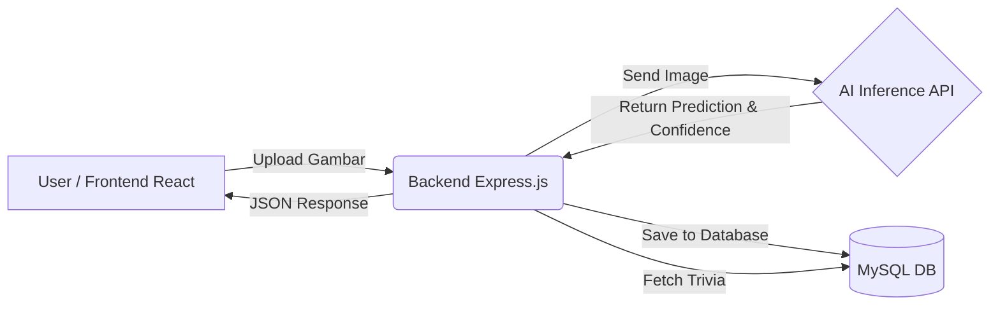

<div align="center">
  <h1>📜 NayaAksara</h1>
  <p><strong>AI-Powered Handwritten Javanese Script Recognition for Interactive Learning</strong></p>
  <p><i>Accessible & Adaptive Learning</i></p>
  
  ---
  
  **Master Technical Handover Document**  
  **Version:** 1.0 Final Capstone  
  **Tanggal:** 5 Juni 2026
</div>

## 📖 1. Project Overview

**NayaAksara** bertujuan untuk membantu pengguna mempelajari dan melestarikan Aksara Jawa melalui sistem pembelajaran interaktif berbasis *Artificial Intelligence* yang mampu mengenali tulisan tangan pengguna secara otomatis.

### 🛑 Latar Belakang & Masalah
* Semakin menurunnya minat generasi muda dalam mempelajari Aksara Jawa.
* Media pembelajaran saat ini masih terlalu dominan pada teori dan hafalan konvensional.
* Tidak tersedianya validasi otomatis saat pengguna mencoba berlatih menulis secara mandiri.
* Pengguna kesulitan mengetahui letak kesalahan atau kebenaran tulisan tangan yang mereka buat.

### 💡 Solusi NayaAksara
NayaAksara hadir sebagai aplikasi berbasis web interaktif yang memungkinkan pengguna untuk:
1. **Mengunggah** gambar/foto tulisan tangan Aksara Jawa.
2. **Mengenali** aksara menggunakan model AI (CNN) dengan cepat.
3. **Mendapatkan validasi** berupa skor tingkat keyakinan (*confidence score*).
4. **Menerima *feedback*** instan (Valid / Tidak Valid).
5. **Mempelajari trivia** dan informasi historis menarik mengenai aksara yang berhasil dikenali.

---

## 👥 2. Tim Pengembang

| Peran | Nama Anggota |
| :--- | :--- |
| **Project Lead** | Jasmine Az Zahra Ihsani |
| **Project Initiator** | I Made Krishna Chandra |
| **AI Engineer** | I Made Krishna Chandra, Harits Abdurrahman Aufa |
| **Data Scientist** | Jasmine Az Zahra Ihsani, Pangestuti Bunga Yulianti |
| **Frontend Engineer** | Fauzan |
| **Backend Engineer** | Muhammad Andra Ariesfi |

---

## 💻 3. Tech Stack

<div style="display: flex; gap: 20px;">
  <div>
    <strong>Frontend</strong>
    <ul>
      <li>ReactJS</li>
      <li>React Router</li>
    </ul>
  </div>
  <div>
    <strong>Backend</strong>
    <ul>
      <li>Node.js</li>
      <li>Express.js</li>
      <li>Multer & Axios</li>
    </ul>
  </div>
  <div>
    <strong>Database & AI</strong>
    <ul>
      <li>MySQL</li>
      <li>TensorFlow / Keras (CNN)</li>
      <li>HuggingFace Spaces API</li>
    </ul>
  </div>
</div>

---

## ⚙️ 4. Arsitektur Sistem

Aplikasi ini menggunakan siklus data yang berkesinambungan antara *Client*, *Server*, dan *AI Model Endpoint*.



### Detail Alur Data:
1. User mengunggah gambar melalui UI aplikasi.
2. *Frontend* mengirimkan file melalui REST API ke *Backend*.
3. *Backend* menyimpannya sementara dan meneruskan *request* file ke **AI Endpoint**.
4. Model AI mengembalikan hasil `prediction` dan `confidence` score.
5. *Backend* mengevaluasi skor tersebut (berdasarkan *threshold* validasi).
6. *Backend* mengambil informasi trivia dari database MySQL berdasarkan aksara yang terdeteksi.
7. Seluruh riwayat (submission) disimpan di database untuk *tracking*.
8. Hasil final dikembalikan ke *Frontend* untuk ditampilkan kepada User.

---

## 📂 5. Struktur Proyek

Repositori ini telah dikonsolidasikan dan dibagi menjadi dua direktori utama:

```text
NayaAksara/
├── backend/                  # REST API Server & Services
│   ├── app.js                # Main server entry
│   ├── config/db.js          # MySQL connection config
│   ├── routes/               # API endpoints (submit, trivia, dll)
│   ├── services/             # Integrasi external service (aiService.js)
│   ├── uploads/              # Temp storage untuk file gambar
│   ├── package.json
│   └── .env
│
├── frontend/                 # Client UI (Vite + React)
│   ├── src/
│   │   ├── components/       # Reusable UI components (Navbar, dll)
│   │   ├── pages/            # View pages (Upload, Scoring, Trivia, dll)
│   │   ├── services/         # Axios API caller
│   │   └── style/            # Modul CSS spesifik
│   ├── index.html
│   └── package.json
│
└── README.md
```

---

## 🗄️ 6. Skema Database

Sistem ini didukung oleh basis data MySQL dengan skema tabel berikut:

### Tabel `submissions`
Digunakan untuk mencatat seluruh riwayat hasil prediksi (gambar yang dikirim user).
```sql
CREATE TABLE submissions (
  id INT AUTO_INCREMENT PRIMARY KEY,
  image_path VARCHAR(255),
  prediction VARCHAR(50),
  confidence FLOAT,
  is_valid BOOLEAN,
  created_at TIMESTAMP DEFAULT CURRENT_TIMESTAMP
);
```

### Tabel `trivia_pool`
Menyimpan bank fakta-fakta edukatif tentang Aksara Jawa.
```sql
CREATE TABLE trivia_pool (
  id INT AUTO_INCREMENT PRIMARY KEY,
  aksara VARCHAR(50),
  content TEXT
);
```

---

## 🧠 7. Integrasi AI

Untuk alasan stabilitas dan *uptime*, layanan AI yang awalnya menggunakan **Ngrok** telah dimigrasikan sepenuhnya ke infrastruktur cloud **HuggingFace Space**.

* **Base URL Endpoint:** `https://ikchandra-nayaaksara.hf.space/`
* **Route Endpoint:** `POST /predict`
* **Format Request:** `multipart/form-data` (Field: `image`)
* **Contoh Response JSON:**
  ```json
  {
    "prediction": "na",
    "confidence": 0.8816
  }
  ```

---

## ✅ 8. Validasi & Logika Backend

Proses validasi kelayakan prediksi dikontrol secara ketat melalui parameter *Threshold* yang disarankan oleh Tim AI:

```javascript
const MIN_CONFIDENCE = 0.60;
```
* **Status `Valid`**: Jika `confidence >= 0.60`
* **Status `Tidak Valid`**: Jika `confidence < 0.60`

*Alasan penetapan*: Rata-rata confidence model CNN yang dirancang menghasilkan angka di rentang akurasi tersebut, sehingga skor 60% ditetapkan sebagai standar kelulusan awal.

---

## 🚀 9. Milestone & Perubahan Signifikan

Bagian ini merangkum penyelesaian masalah dan pengoptimalan utama yang telah dicapai dalam persiapan peluncuran.

| Kategori | Sebelum Perbaikan | Setelah Perbaikan | Status |
| :--- | :--- | :--- | :---: |
| **Endpoint AI** | Menggunakan Ngrok lokal, sering mati. | Terhubung penuh ke HuggingFace Space. | 🟢 Selesai |
| **Integrasi AI** | `throw new Error("AI endpoint belum aktif")` | Terhubung aktif dengan backend `aiService.js`. | 🟢 Selesai |
| **Bug Backend** | *Error:* `predictImage is not defined` | Perbaikan import modul / route. | 🟢 Selesai |
| **Logic Threshold** | Threshold dipatok di angka `0.05`. | Threshold rasional dinormalisasi ke `0.60`. | 🟢 Selesai |
| **Trivia Data** | Randomize error (Aksara NA tapi trivia HA). | Sinkronisasi SQL: `WHERE aksara = ?`. | 🟢 Selesai |
| **Bank Trivia** | Hanya tersedia 3 aksara. | Ditambahkan untuk seluruh 20 Aksara Hanacaraka. | 🟢 Selesai |
| **Scoring UI** | Menggunakan metrik "palsu" (*dummy*). | Menggunakan data live Confidence Score asli dari AI. | 🟢 Selesai |

---

## 📊 10. Hasil Evaluasi & Testing Aksara

Proses pengujian (UAT) menunjukkan kemampuan deteksi model pada sampel dataset:

* **Aksara NA:** Prediksi `NA` | Confidence `88.16%` ➔ **BERHASIL**
* **Aksara CA:** Prediksi `CA` | Confidence `95.66%` ➔ **BERHASIL**
* **Aksara RA:** Prediksi `RA` | Confidence `96.76%` ➔ **BERHASIL**
* **Aksara KA:** Prediksi `KA` | Confidence `89.45%` ➔ **BERHASIL**
* **Aksara DA:** Prediksi `DA` | Confidence `86.48%` ➔ **BERHASIL**

---

## 🐞 11. Temuan Bug Terbuka (Known Issues)

Terdapat batasan model AI yang harus diperhatikan untuk *improvement* ke depannya:

1. **Akurasi Aksara HA Rendah**
   * *Input*: Aksara `HA` dideteksi sebagai `PA` dengan Confidence `37.2%`.
   * *Kesimpulan*: Kemungkinan masalah dataset latih yang tidak seimbang atau fitur kelas yang bertabrakan.
2. **Ketiadaan Kelas "Bukan Aksara"**
   * *Input*: Gambar acak (non-aksara) dimasukkan.
   * *Output*: Kadang ditebak sebagai aksara tertentu dengan Confidence 98% - 99%.
   * *Kesimpulan*: Model AI memaksa input apapun untuk masuk ke salah satu dari 20 kelas aksara, karena belum dilatih mendeteksi kondisi *"Unknown"*.

---

## 🌍 12. Status Deployment

| Layer | Lingkungan | Platform / Target | Status Saat Ini |
| :--- | :--- | :--- | :--- |
| **Frontend UI** | Client-Side | Vercel | 🟡 Belum Deploy (Ready to deploy) |
| **Backend API** | Server-Side | Railway / Render | 🟡 Belum Deploy (Ready to deploy) |
| **Database** | Storage | Cloud MySQL (PlanetScale/CleverCloud) | 🟡 Localhost (`DB_HOST=localhost`) |
| **AI Model** | Inference API | HuggingFace Space | 🟢 **ONLINE** |

---

## 🔮 13. Future Improvements (Roadmap)

**🔴 Prioritas Tinggi (Immediate Action):**
1. Eksekusi deployment ke tahap Production (Vercel & Railway).
2. Migrasi *local database* ke layanan Cloud Database.
3. Migrasi penyimpanan file `uploads` lokal ke *Cloud Storage* (AWS S3 / Cloudinary).
4. Penambahan dataset dan pembuatan threshold penolakan kelas asing (*Random Image Detection*).

**🟡 Prioritas Menengah (Next Iteration):**
5. Penambahan dataset latih variatif & *Retraining* AI Model.
6. Pembuatan sistem akun pengguna (Autentikasi).
7. Panel analitik riwayat progres pembelajaran pengguna.

**🟢 Prioritas Rendah (Nice-to-have):**
8. Sistem Papan Peringkat (Leaderboard) & Pencapaian (Achievements).
9. Dashboard analitik mendalam untuk pengajar.

---

<div align="center">
  <h3>✨ KESIMPULAN AKHIR ✨</h3>
  <p><strong>Status Proyek:</strong> Layak didemokan, dipresentasikan, serta dilakukan submit untuk penilaian Capstone.</p>
  <p><em>Frontend (85%) — Backend (90%) — AI Integration (90%)</em></p>
  <p><small>Catatan: Sisa perbaikan (minor bug) saat ini difokuskan di area optimasi model dataset AI dan staging deployment.</small></p>
</div>
